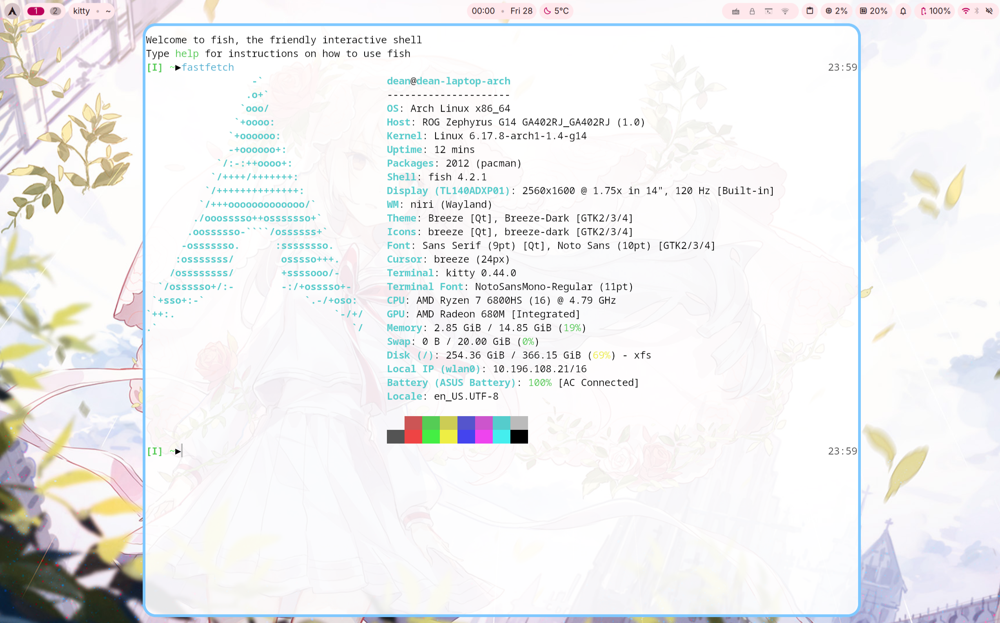
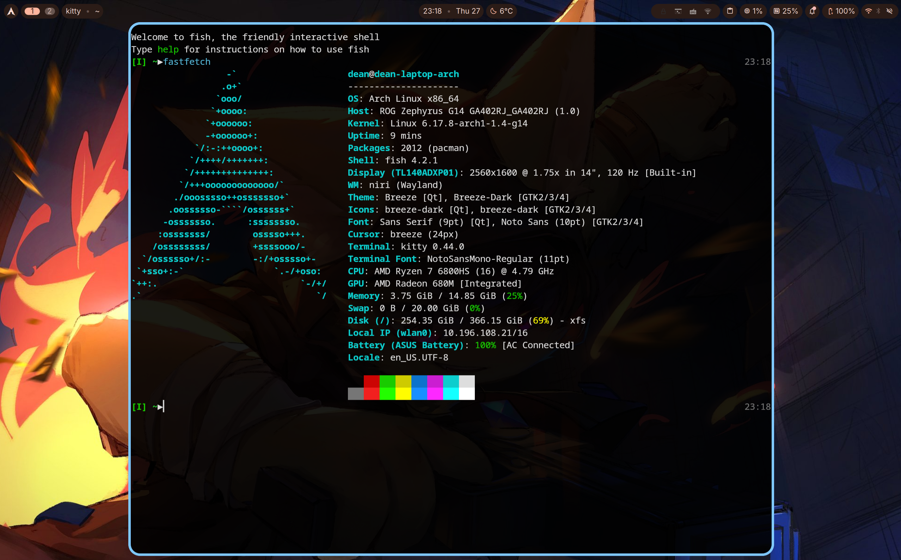
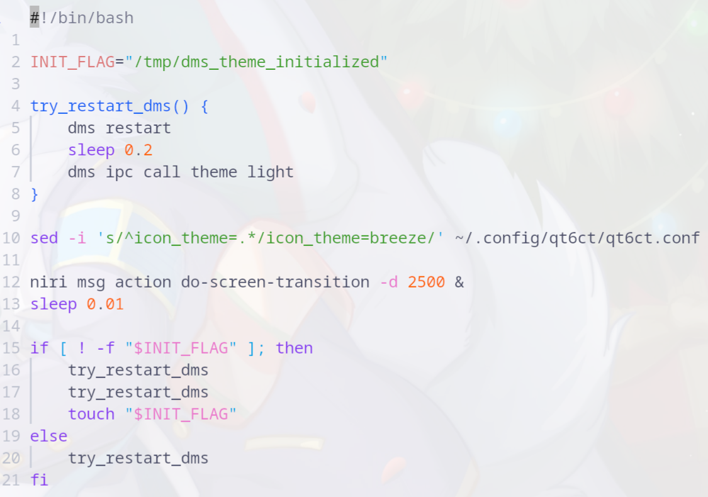
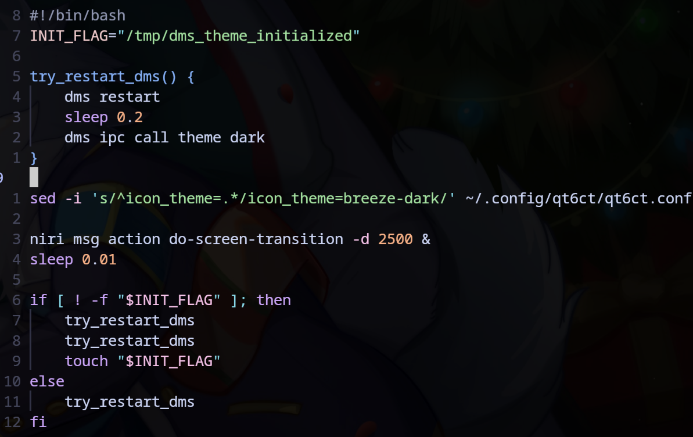
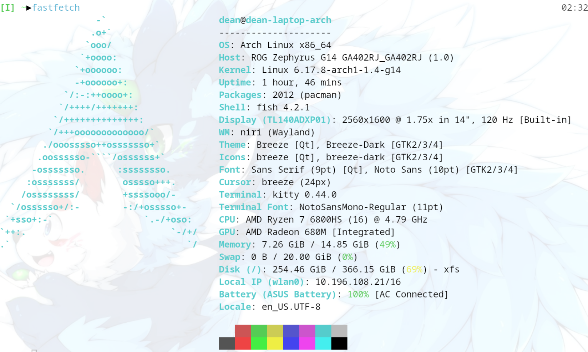
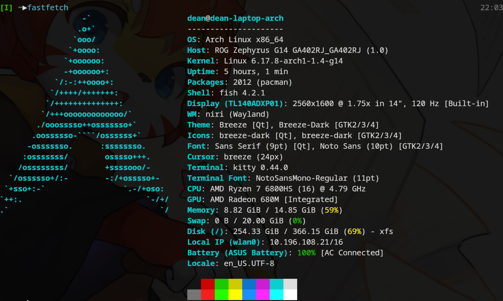
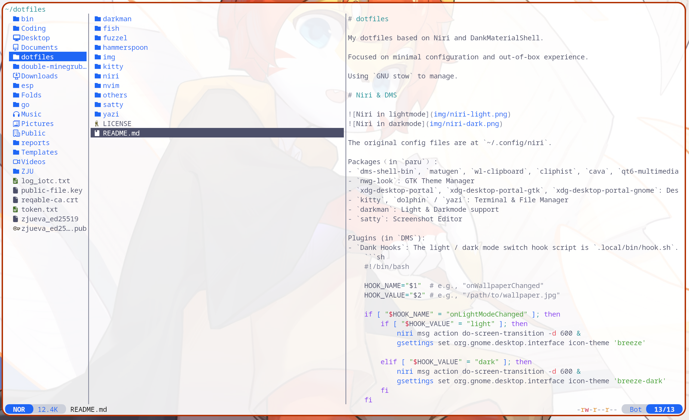
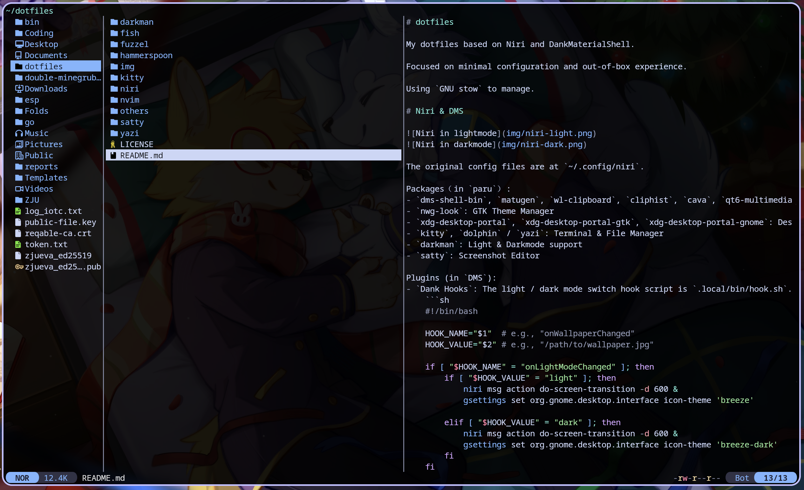
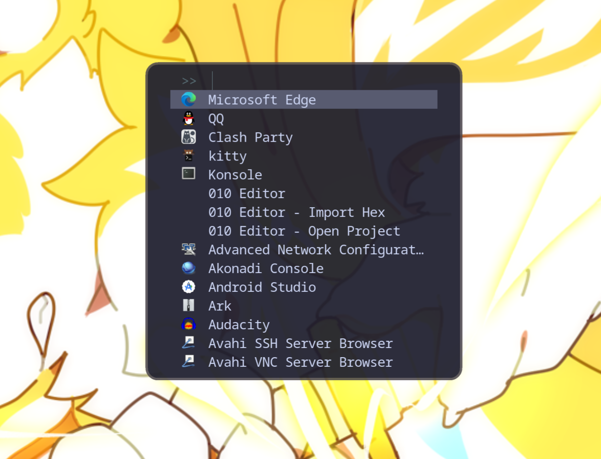
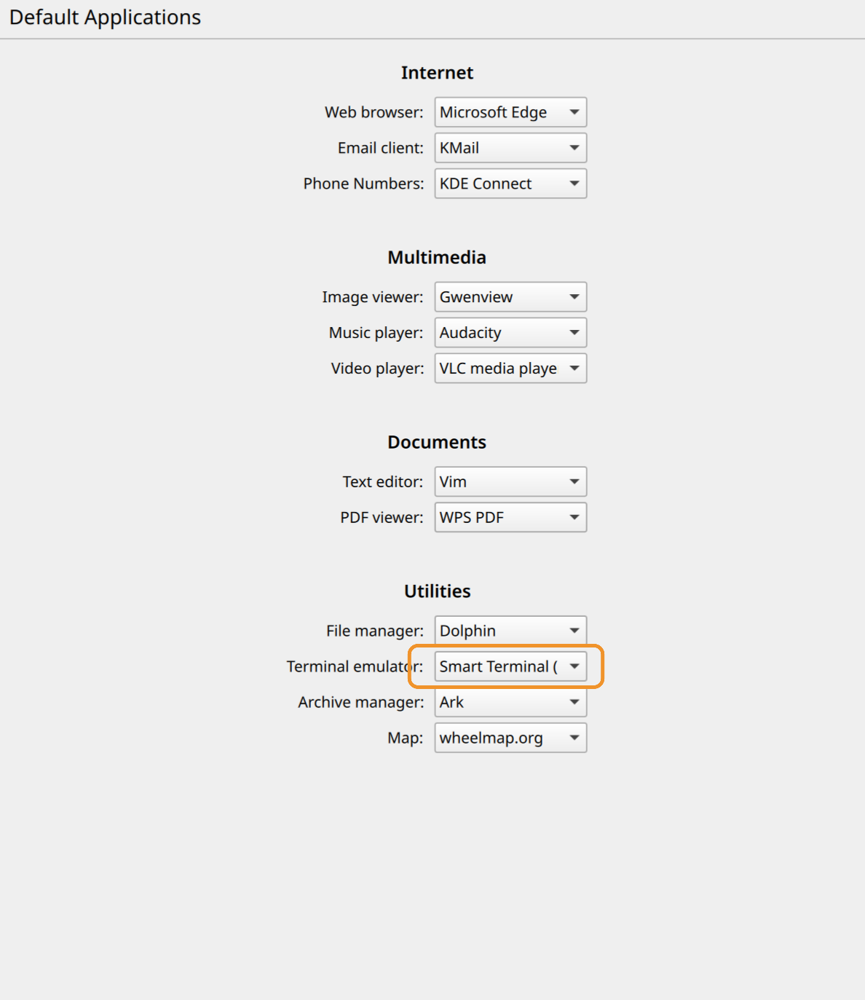

# dotfiles

My dotfiles based on Niri and DankMaterialShell.

Focused on minimal configuration and out-of-box experience.

Using `GNU stow` to manage.

# Niri & DMS




The original config files are at `~/.config/niri`.

Packages（in `paru`）:
- `dms-shell-bin`, `matugen`, `wl-clipboard`, `cliphist`, `cava`, `qt6-multimedia-ffmpeg`, `dsearch-bin`: DankMaterialShell
- `nwg-look`: GTK Theme Manager
- `xdg-desktop-portal`, `xdg-desktop-portal-gtk`, `xdg-desktop-portal-gnome`: Desktop API for screen casting etc.
- `kitty`, `dolphin` / `yazi`: Terminal & File Manager
- `darkman`: Light & Darkmode support
- `satty`: Screenshot Editor

Plugins (in `DMS`):
- `Dank Hooks`: The light / dark mode switch hook script is `.local/bin/hook.sh`.
    ```sh
    #!/bin/bash

    HOOK_NAME="$1"  # e.g., "onWallpaperChanged"
    HOOK_VALUE="$2" # e.g., "/path/to/wallpaper.jpg"

    if [ "$HOOK_NAME" = "onLightModeChanged" ]; then
        if [ "$HOOK_VALUE" = "light" ]; then
            niri msg action do-screen-transition -d 600 &
            gsettings set org.gnome.desktop.interface icon-theme 'breeze'

        elif [ "$HOOK_VALUE" = "dark" ]; then
            niri msg action do-screen-transition -d 600 &
            gsettings set org.gnome.desktop.interface icon-theme 'breeze-dark'
        fi
    fi
    ```
- `Calculator`: Calculator in DMS Spotlight
    - trigger: `=`
- `Web Search`: Search Plugin in DMS Spotlight
    - trigger: `?`
- `Command Runner`: Calculator in DMS Spotlight
    - trigger: `>`
- `Emoji & Unicode Launcher`: Emoji & Unicode Picker in DMS Spotlight
    - trigger: `:`
- `Dank Battery Alerts`: Receive notifications when battery level is low
- `ASUS Control Center`: Manage Power Profiles and GPU Modes for ASUS Laptops

Before apply the config files, please configure the `outputs.kdl` file according to the display or execute `niri msg outputs`:

```kdl
// ...
output "eDP-1" {
    mode "2560x1440@120.000"
    scale 2
    // ...
}
// ...
```

## Deploy

```sh
cd dotfiles
stow --dotfiles niri
```

# Nvim

Inspired by [MartinLwx](https://martinlwx.github.io/zh-cn/config-neovim-from-scratch/). Thanks!




The original config files are at `~/.config/nvim`.

Plugins (managed by `lazy.nvim`):
- `"catppuccin/nvim"`: Nvim Theme 
- `"lukas-reineke/indent-blankline.nvim"`: Indent Blankline
- `"ethanholz/nvim-lastplace"`: Intelligently reopens files at your last edit position
- `"onsails/lspkind.nvim"`: Vscode-like pictograms 
- `"saghen/blink.cmp"`: Auto-completion engine
- `"L3MON4D3/LuaSnip"`: Code snippet engine
- `"mason-org/mason.nvim"`, `"neovim/nvim-lspconfig"`: LSP manager
- `"xiyaowong/transparent.nvim"`: Transparent background

## Deploy

```sh
cd dotfiles
stow --dotfiles nvim
```

# Kitty




The original config files are at `~/.config/kitty`.

Using default dark theme and customized default light theme.

To automatically switch kitty themes between light and dark mode, make sure these files exist:
- `.config/kitty/dark-theme.auto.conf`: `color-scheme` == `'prefer-dark'`
- `.config/kitty/light-theme.auto.conf`: `color-scheme` == `'prefer-light'`
- `.config/kitty/no-preference-theme.auto.conf`: `color-scheme` == `'default'`

## Deploy

```sh
cd dotfiles/kitty/.config/kitty
ln -s font-mac.conf font-platform.conf # On macOS
ln -s font-linux.conf font-platform.conf # On Linux
cd ../../..
stow --dotfiles kitty
```

# Darkman

The original script directory is `~/.local/share/darkman`.

I wrote a script to restart and change the icons of dms monitor changes in the system `color-scheme` and adjust Kitty's theme accordingly.

> Currently dms has a bug that the first attempt after initialization to restart dms will fail, thus the script will restart dms twice at session startup.

> Currently dms has a bug that the system tray widget might be failed to recover after dms restarts.

```sh
#!/bin/bash

MODE="$1"
INIT_FLAG="/tmp/dms_theme_initialized"

case "$MODE" in
    dark)
        THEME_ARG="dark"
        ICON_THEME="breeze-dark"
        ;;
    light)
        THEME_ARG="light"
        ICON_THEME="breeze"
        ;;
    *)
        echo "Usage: $0 {dark|light}"
        exit 1
        ;;
esac

try_restart_dms() {
    dms restart
    sleep 0.2
    dms ipc call theme "$THEME_ARG"
}

gsettings set org.gnome.desktop.interface icon-theme "$ICON_THEME"

niri msg action do-screen-transition -d 2500 &
sleep 0.01

if [ ! -f "$INIT_FLAG" ]; then
    try_restart_dms
    try_restart_dms
    touch "$INIT_FLAG"
else
    try_restart_dms
fi
```

If you are not concerned about the color of the icon, use this script instead, it's way more faster and smoother. (Default)

```sh
#!/bin/bash

case "$1" in
    dark)
        dms ipc call theme dark
        sed -i 's/^icon_theme=.*/icon_theme=breeze-dark/' ~/.config/qt6ct/qt6ct.conf
        ;;
    light)
        dms ipc call theme light
        sed -i 's/^icon_theme=.*/icon_theme=breeze/' ~/.config/qt6ct/qt6ct.conf
        ;;
    *)
        echo "Usage: $0 {dark|light}"
        exit 1
        ;;
esac

niri msg action do-screen-transition -d 500 &
```

## Deploy

```sh
cd dotfiles
stow --dotfiles darkman
```

(If using the Icon-changing scripts)
```sh
cd dotfiles/darkman/.local/share/darkman
mv niri-theme.sh niri-theme.sh.bak
mv niri-theme-icon.sh.bak niri-theme-icon.sh
chmod +x niri-theme-icon.sh
chmod -x niri-theme.sh.bak
cd ../../../..
stow --dotfiles darkman
```

# Yazi




The original config files are at `~/.config/yazi`.


Plugins & Flavors:
- `"simla33/ucp"`: Integrates yazi copy / paste with system clipboard similar to GUI file managers.
- `"yazi-rs/plugins:mount"`: A mount manager for Yazi, providing disk mount, unmount, and eject functionality.
- `"yazi-rs/flavors:catppuccin-latte"`: Catppuccin latte for yazi.
- `"yazi-rs/flavors:catppuccin-mocha"`: Catppuccin mocha for yazi.

## Deploy

Install Catppuccin flavors:

```sh
ya pkg add simla33/ucp
ya pkg add yazi-rs/plugins:mount
ya pkg add yazi-rs/flavors:catppuccin-latte
ya pkg add yazi-rs/flavors:catppuccin-mocha
```

```sh
cd dotfiles
stow --dotfiles yazi
```


# Fuzzel



The original config files are at `~/.config/fuzzel`.

## Deploy

```sh
cd dotfiles
stow --dotfiles fuzzel
```

# Satty

The original config files are at `~/.config/satty`.

## Deploy

```sh
cd dotfiles
stow --dotfiles satty
```

# Fish

The original config files are at `~/.config/fish`.

## Deploy

```sh
cd dotfiles
stow --dotfiles fish
fisher update
```

# Others

## Dolphin Context Menu

In Dolphin (KDE Plasma), we can use `Alt + Shift + F4` to Open Terminal in current folder, and the default terminal is Konsole.

In Niri, we want to open current folder with Kitty. I wrote a script and context menu to do this.

```sh
#!/bin/bash

if [[ "$XDG_CURRENT_DESKTOP" == *"niri"* ]] || [[ "$XDG_SESSION_DESKTOP" == *"niri"* ]]; then
    exec kitty "${@/--workdir/--directory}"
else
    exec konsole "$@"
fi
```

```desktop
[Desktop Entry]
Name=Smart Terminal (Niri / KDE)
Comment=Opens Kitty in Niri, Konsole in KDE
Exec=bash -c /home/dean/.local/bin/smart-terminal.sh %f
Icon=utilities-terminal
Type=Application
Categories=System;TerminalEmulator;
Terminal=false
```

## Qt XWayland Application

Some applications running on XWayland, especially using outdated QT version, like `wps-office-365`, has a dpi issue when scaling is applied.

The solution is to create `.Xresources` file and set independent dpi for those applications:

```
Xft.dpi: 168 // = 96 * scale
```

Then apply at startup:
```kdl
// ...
spawn-sh-at-startup "xrdb -merge ~/.Xresources"
// ...
```

## OBS Screencasting

According to [Niri's Official Wiki](https://yalter.github.io/niri/Screencasting.html), we need a working D-Bus session, pipewire, `xdg-desktop-portal-gnome`. If you don't want to install any gnome-related packages, you could change it to `xdg-desktop-portal-wlr`, but it can only capture entire screen other than individual window.

Create `~/.config/xdg-desktop-portal/niri-portals.conf`:
```conf
[preferred]
default=gtk;
org.freedesktop.impl.portal.Access=gtk;
org.freedesktop.impl.portal.Notification=gtk;
org.freedesktop.impl.portal.ScreenCast=wlr;
org.freedesktop.impl.portal.Screenshot=wlr;
```

When using `xdg-desktop-portal-gnome`:
```conf
[preferred]
default=gtk;
org.freedesktop.impl.portal.Access=gtk;
org.freedesktop.impl.portal.Notification=gtk;
org.freedesktop.impl.portal.ScreenCast=gnome;
org.freedesktop.impl.portal.Screenshot=gnome;
```

## QQ clipboard

I have no idea why `linuxqq` still use X11 clipboard in Wayland session. I wrote a script to solve this. Inspired by [akatsukiro](https://blog.chs.pub/p/25-06-niri/#x11-wayland-%E5%89%AA%E5%88%87%E6%9D%BF%E5%90%8C%E6%AD%A5)'s script, thanks!

Using `clipnotify` to watch X11 clipboard change.

```sh
#!/bin/bash
# .local/bin/clipboard_x11towl.sh

LOCK_FILE="/tmp/clipboard_bridge_lock"

TMP_DIR="/tmp/clipboard_sync_$$"
mkdir -p "$TMP_DIR"
trap "rm -rf '$TMP_DIR'; exit" INT TERM EXIT

COLOR_RESET="\033[0m"
COLOR_GREEN="\033[32m"
COLOR_BLUE="\033[34m"
COLOR_YELLOW="\033[33m"
COLOR_CYAN="\033[36m"

log() {
    local timestamp=$(date '+%H:%M:%S')
    echo -e "${COLOR_CYAN}[$timestamp]${COLOR_RESET} $1"
}

log_sync() {
    local direction=$1
    local type=$2
    local format=$3

    case "$direction" in
        "x11->wl")
            echo -e "${COLOR_CYAN}[$(date '+%H:%M:%S')]${COLOR_RESET} ${COLOR_GREEN}✓${COLOR_RESET} X11 → Wayland | ${COLOR_YELLOW}${type}${COLOR_RESET}${format}"
            ;;
    esac
}

for cmd in xclip wl-copy clipnotify cmp; do
    if ! command -v "$cmd" &> /dev/null; then
        echo "Error: Missing dependency '$cmd'"
        exit 1
    fi
done

echo "Starting X11 -> Wayland sync (Event-driven with clipnotify)..."

clipboard_sync() {
    local current_x11_img="$TMP_DIR/curr_x11.img"
    local current_wl_img="$TMP_DIR/curr_wl.img"
    local last_x11_img="$TMP_DIR/last_x11.img"
    local last_text=""
    
    rm -f "$LOCK_FILE"

    while clipnotify; do
        if [ -f "$LOCK_FILE" ]; then
            sleep 0.2
            continue
        fi
        # ==========================

        sleep 0.05
        img_synced=false

        x11_targets=$(xclip -selection clipboard -t TARGETS -o 2>/dev/null)
        [ -z "$x11_targets" ] && continue

        mime_type=""
        if [[ "$x11_targets" == *"image/png"* ]]; then
            mime_type="image/png"
        elif [[ "$x11_targets" == *"image/jpeg"* ]]; then
            mime_type="image/jpeg"
        elif [[ "$x11_targets" == *"image/gif"* ]]; then
            mime_type="image/gif"
        fi

        if [[ -n "$mime_type" ]]; then
            xclip -selection clipboard -t "$mime_type" -o > "$current_x11_img" 2>/dev/null
            wl-paste -t "$mime_type" > "$current_wl_img" 2>/dev/null
            
            if cmp -s "$current_x11_img" "$current_wl_img"; then
                continue
            fi
            
            if ! cmp -s "$current_x11_img" "$last_x11_img"; then
                wl-copy -t "$mime_type" < "$current_x11_img"
                cp "$current_x11_img" "$last_x11_img"
                log_sync "x11->wl" "Image" " ($mime_type)"
                img_synced=true
            fi
            continue 
        fi

        # -------- Text sync --------
        if [[ "$img_synced" == false ]]; then
            current_text=$(wl-paste --type text/plain 2>/dev/null || true)
            x11_text=$(xclip -selection clipboard -o 2>/dev/null || true)

            if [[ -n "$x11_text" && "$x11_text" != "$last_text" && "$x11_text" != "$current_text" ]]; then
                echo -n "$x11_text" | wl-copy --type text/plain
                last_text="$x11_text"
                
                local preview="${x11_text:0:50}"
                preview="${preview//$'\n'/↵}"
                preview="${preview//$'\r'/}"
                preview="${preview//$'\t'/⇥}"
                [[ ${#x11_text} -gt 50 ]] && preview="${preview}..."
                log_sync "x11->wl" "Text" " \"$preview\""
            fi
        fi
    done
}

log "Clipboard sync service started"
log "Monitoring Wayland ↔ X11 clipboard sync..."

clipboard_sync
```

```sh
#!/bin/bash
# .local/bin/clipboard_wltox11.sh

LOCK_FILE="/tmp/clipboard_bridge_lock"

trap "rm -f '$LOCK_FILE'" EXIT

touch "$LOCK_FILE"

types=$(wl-paste --list-types)

if [[ "$types" == *"image/png"* ]]; then
    wl-paste --type image/png | xclip -selection clipboard -t image/png
elif [[ "$types" == *"image/jpeg"* ]]; then
    wl-paste --type image/jpeg | xclip -selection clipboard -t image/jpeg
elif [[ "$types" == *"image/gif"* ]]; then
    wl-paste --type image/gif | xclip -selection clipboard -t image/gif
else
    wl-paste | xclip -selection clipboard
fi

sleep 0.1

rm -f "$LOCK_FILE"
```

```kdl
// ...
spawn-at-startup "wl-paste" "--watch" "bash" "-c" "~/.local/bin/clipboard-wltox11.sh"
spawn-at-startup "bash" "-c" "~/.local/bin/clipboard-x11towl.sh"
// ...
```

## Deploy

```sh
cd dotfiles
stow --dotfiles others
kcmshell6 componentchooser
```

In the `componentchooser` window, choose Terminal Simulator to `Smart Terminal (Niri / KDE)`.

